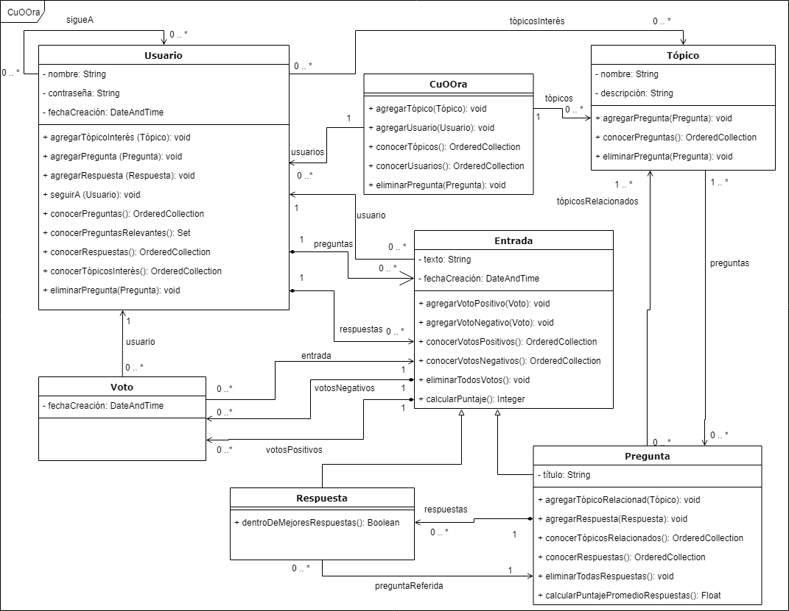

# CuOOra
* CuOOra: red social de preguntas y respuestas.
* Trabajo final de Técnicas y Herramientas 2019
* Maestría en Ingeniería de Software
* Universidad Nacional de La Plata (UNLP)

### Autores
* Julieta Ríos (DNI: 39.448.440, julirios299@gmail.com)
* Gonzalo Ulla (DNI: 39.079.547, gonzaulla@gmail.com)

## Tabla de Contenidos
1. [Enunciado](https://github.com/GonzaloUlla/unlp-tyh-cuoora/blob/master/TP1%20-%20Enunciado.pdf)
2. [Diagrama de Clases UML](#diagrama-de-clases-uml)
3. [Paquetes st](#paquetes-st)
4. [Notas de Clase](https://github.com/GonzaloUlla/unlp-tyh-cuoora/blob/master/notas-de-clase)

## Diagrama de Clases UML
* [Diagrama de Clases UML en PNG](https://github.com/GonzaloUlla/unlp-tyh-cuoora/blob/master/diagrams/UNLP-TyH-TP1-CuOOra-Class-Diagram.png)
* [Diagrama de Clases UML en PDF](https://github.com/GonzaloUlla/unlp-tyh-cuoora/blob/master/diagrams/UNLP-TyH-TP1-CuOOra-Class-Diagram.pdf)
* [Diagrama de Clases UML en Google Drive - draw.io](https://drive.google.com/file/d/1ZxY7S2dx9snVGjNJxClkLEa_J22xiDb5/view?usp=sharing)

## Paquetes st
* [CuOOra-TyH-TP-Model.st](https://github.com/GonzaloUlla/unlp-tyh-cuoora/blob/master/packages/CuOOra-TyH-TP-Model.st)
* [CuOOra-TyH-TP-Test.st](https://github.com/GonzaloUlla/unlp-tyh-cuoora/blob/master/packages/CuOOra-TyH-TP-Test.st)
