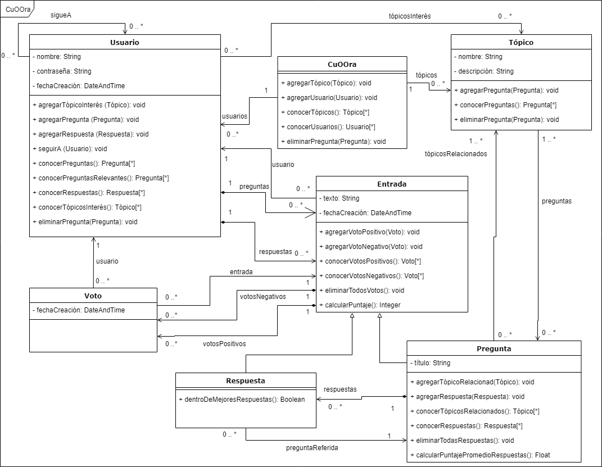

# CuOOra

* CuOOra: red social de preguntas y respuestas.
* Trabajo final de Técnicas y Herramientas (TyH) 2019
* Trabajo final de Tópicos de Ingeniería de Software II (TIS2) 2019
* Maestría en Ingeniería de Software
* Universidad Nacional de La Plata (UNLP)

## Información del Grupo

### Autores

* Julieta Ríos (DNI: 39.448.440, julirios299@gmail.com)
* Gonzalo Ulla (DNI: 39.079.547, gonzaulla@gmail.com)

### URL de la aplicación

* [http://localhost:8080/CuOOra](http://localhost:8080/CuOOra)

## Tabla de Contenidos

1. [Paquetes .st entregables](#paquetes-.st-entregables)
2. [Playgrounds](#playgrounds)
3. [Documentos TIS2](https://drive.google.com/open?id=191Q-8EbY00TOCwspD3C85YjOrJVn54ifaWEMYwijUXM)
4. [Diagrama de Clases UML Original TyH](#diagrama-de-clases-uml-original-tyh)
5. [Enunciado TP2 TIS2](https://github.com/GonzaloUlla/unlp-tyh-cuoora/blob/master/docs/TP2%20-%20TIS2.pdf)
6. [Enunciado TP1 TyH](https://github.com/GonzaloUlla/unlp-tyh-cuoora/blob/master/docs/TP1%20-%20Enunciado.pdf)
7. [Enunciado TP2 TyH](https://github.com/GonzaloUlla/unlp-tyh-cuoora/blob/master/docs/TP2%20-%20Web.pdf)
8. [Notas de Clase](https://github.com/GonzaloUlla/unlp-tyh-cuoora/blob/master/docs/class-notes)

## Paquetes .st entregables

* [CuOOra-TyH-TP-Model.st](https://github.com/GonzaloUlla/unlp-tyh-cuoora/blob/master/packages/CuOOra-TyH-TP-Model.st)
* [CuOOra-TyH-TP-Test.st](https://github.com/GonzaloUlla/unlp-tyh-cuoora/blob/master/packages/CuOOra-TyH-TP-Test.st)
* [CuOOra-TyH-TP-Web.st](https://github.com/GonzaloUlla/unlp-tyh-cuoora/blob/master/packages/CuOOra-TyH-TP-Web.st)

## Playgrounds

* [Playground TP1](https://github.com/GonzaloUlla/unlp-tyh-cuoora/blob/master/playgrounds/playground-tp1.txt)
* [Playground State](https://github.com/GonzaloUlla/unlp-tyh-cuoora/blob/master/playgrounds/playground-state.txt)
* [Playground Strategy](https://github.com/GonzaloUlla/unlp-tyh-cuoora/blob/master/playgrounds/playground-strategy.txt)
* [Playground Visitor](https://github.com/GonzaloUlla/unlp-tyh-cuoora/blob/master/playgrounds/playground-visitor.txt)

## Diagrama de Clases UML Original TyH

* [Diagrama de Clases UML en PNG](https://github.com/GonzaloUlla/unlp-tyh-cuoora/blob/master/docs/diagrams/UNLP-TyH-TP1-CuOOra-Class-Diagram.png)
* [Diagrama de Clases UML en PDF](https://github.com/GonzaloUlla/unlp-tyh-cuoora/blob/master/docs/diagrams/UNLP-TyH-TP1-CuOOra-Class-Diagram.pdf)
* [Diagrama de Clases UML en Google Drive - draw.io](https://drive.google.com/file/d/1ZxY7S2dx9snVGjNJxClkLEa_J22xiDb5/view?usp=sharing)

