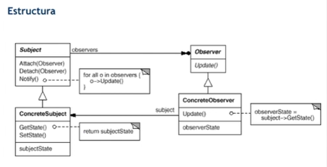
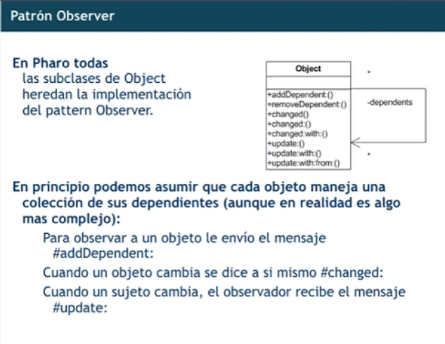

# TyH - Sexta clase remota - 31/05

## Introducción
* Entrega del TP para el 28/06
* Hoy
  * Patrones para aplicaciones interactivas
  * Introducción a aplicaciones web

## Patrones para aplicaciones interactivas
### MVC
* El Modelo y la Vista deben estar desacoplados
  * El Modelo no tiene código específico a la Vista
  * El Modelo no sabe si tiene 0, 1 o N Vistas

## Tecnologías Web de Base
* HTML (HyperText Markup Language)
* URL (Uniform Resource Locator)
* HTTP (HyperText Transfer Protocol)
### Tipos de Arquitecturas
* Client-Side: HTML, CSS, JS, Angular...
* Server-Side
  * Capa de servicio: Web Server
  * Capa de aplicación: Django, Spring, SeaSide
### HTML 5
* WebSockets
* WebWorkers
* LocalStorage
* GeoLocation

DOM (Document Object Model)

## Arquitecturas Web
* Sitios Web estáticos
* Sitios Web dinámicos
* MVVM (Model-view View-model) -Angular-
* Thin clients (HTML 4)
* Thick clients (Gmail offline)

Ajax no se usa más, hacías peticiones asíncronas.
Se usa Web Socket.
