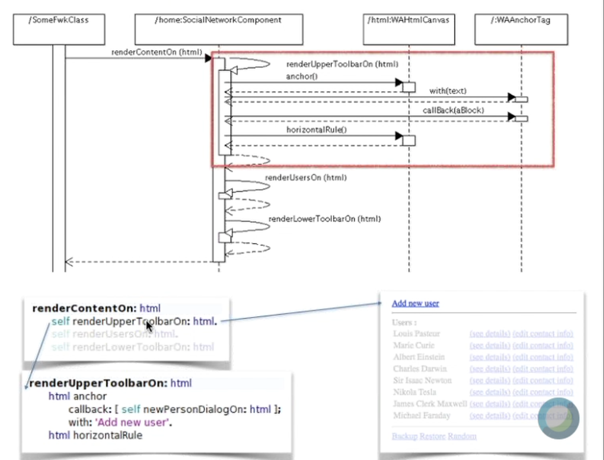

# TyH - Séptima clase remota - 14/06

## Plugins para browsers
* Tampermonkey: run your own JS scripts
* Greasyfork.org: public scripts
* Userstyles.org: CSS

## SeaSide 3.2

Con SeaSide no vamos a escribir JS, CSS ni HTML
* HTML programático
* Una aplicación es un conjunto de componentes
  * Componentes para modelar: navegación y reuso

### Instalación
* Pharo -> Tools -> Catalog Browser
* "Bootstrap for Seaside" Install stable version
#### Configurar un servidor
* Tools -> Seaside Control Panel -> Add adaptor...
* `ZnZincServerAdaptor`, any port

### Programar una aplicación
* Crear una subclase de `WAComponent` (nuestro controlador)
* Implementar `renderContentOn: htmlCanvas`
* `WAAdmin register: self asApplicationAt: 'HolaMundo'`
  * Define dónde se va a registrar el componente principal
    * El "home" de nuestra aplicación que comanda la navegación
  * Esto se hace en el `initialize` a nivel de `Class`
  * `localhost:8080/HolaMundo`

* Una aplicación es un conjunto de componentes
  * Facilita la **navegación** y el manejo de **sesiones**
* Cada página es un componente
  * Las páginas pueden tener hijos y navegan entre sí
* Convención: `PersonComponent`, `PersonEditorComponent`
* Cada componente se envía múltiples mensajes a sí mismo
  * `renderUpperToolbarOn()`
  * `renderUsersOn()`
  * `renderFooterOn()`
    * 7+/-2 líneas de código por método

* Los Tests que ya hicimos heredan de `TestCase` que pertenece a `SUnit`
* Nuestros componentes heredan de `WAComponent` que pertenece a `Seaside`

* Esto permite tener métodos cortos
* Los métodos se van pasando el `html` que permite dibujar elementos

* Acá se ve cómo se envía el contexto entre componentes
* `SocialNetwork` es una clase del Modelo
  * `SocialNetwork#singleton` es un mensaje que devuelve varios usuarios preparados
  * Nos va a servir en `CuOOra`
* También, se ve cómo se maneja el `callback` y cómo se pasan el control los componentes (`show` y `call`/`answer`)
