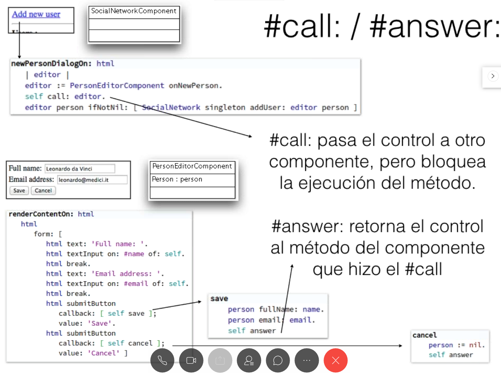

# TyH - Segunda clase presencial - 21/06

## Aprobación de la materia
* Promedio de los dos TPs
### TP 1
* Primera entrega: Lunes 01/07
* Devolución: Jueves 11/07
* Entrega Final: Viernes 19/07
### TP 2
* Primera entrega: 12/08?
* Ver en IDEAS
### Asistencia
* Podemos venir el 12/07 y que la última clase sea el 19/07

## Seaside
### Repaso de la clase pasada
* De nuevo, el énfasis está en separar vista de modelo
### Cómo pasar y devolver el control/responsabilidad de la navegación

* Otra variante de esto es mandar el mensaje `show`
### Hello-World
* `Seaside-Hello-World` package

## Ejemplo en Pharo
* Estructura de paquetes
  * Model
  * Test
  * Web
* Lista de protocolos
  * accessing
  * initialize
  * callbacks
  * rendering
  * testing
  * **instance creation:** constructor a nivel de clase
