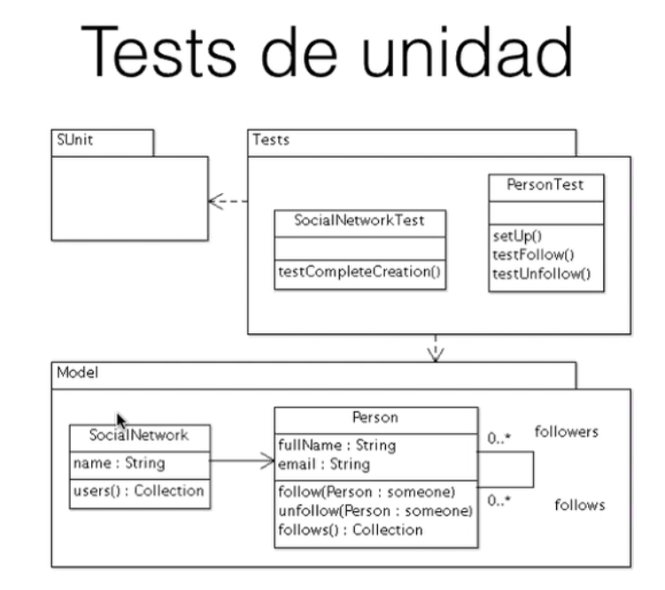

# Dudas sobre el TP CuOOra

## Trabajo Práctico y Unit Tests - TP & UT
* Tests en un paquete separado
* *DUDA:* ¿Hay que hacer el diagrama de clases de los UT?
  * No, está bien separar en dos paquetes
* *DUDA:* ¿Hay incluir validaciones?
  * No
* **DUDA:** ¿Pregunta-Tópico es bidireccional?
* **DUDA:** ¿Un Usuario está compuesto por Entradas?
* *DUDA:* ¿Cobertura?
  * UT para todos los métodos
  * Valores borde, clases de equivalencia, eso se evalúa
  * 100% de cobertura de métodos hechos por nosotros, accessors no
* No evalúan *CSS* ni nada de eso
  * Sí se evalúa la separación entre el Modelo y la Vista, **es lo más importante**
* Tener en cuenta las sugerencias de Pharo (code critic?)
* Versionado y Docker: mail a Grigera
* Agregar un método Singleton a nivel de clase con un ejemplo, datos

