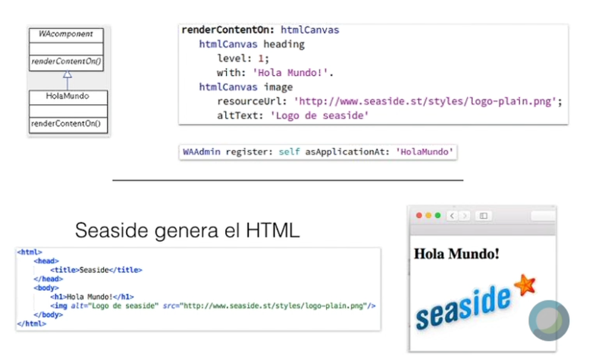
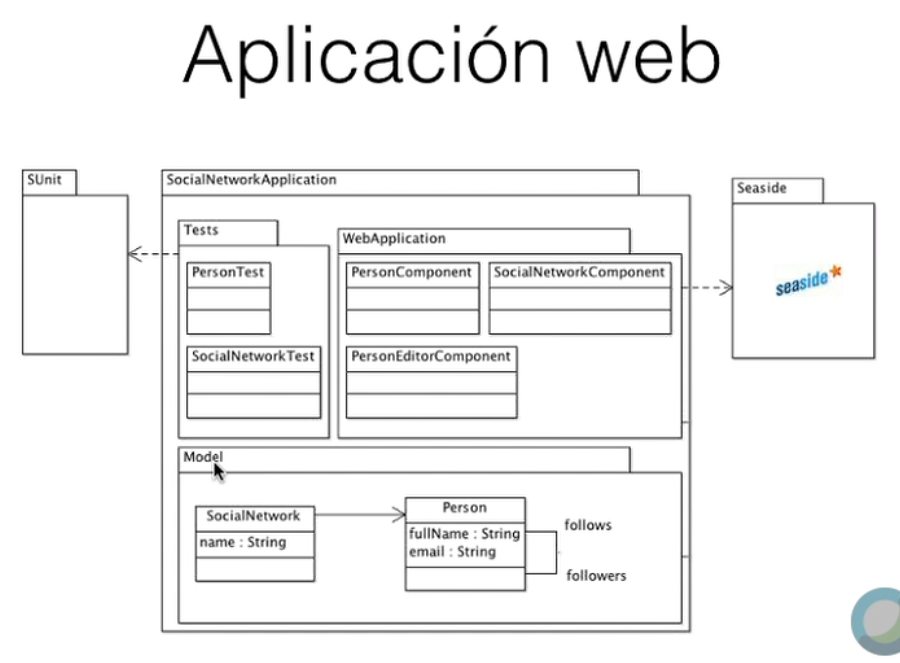
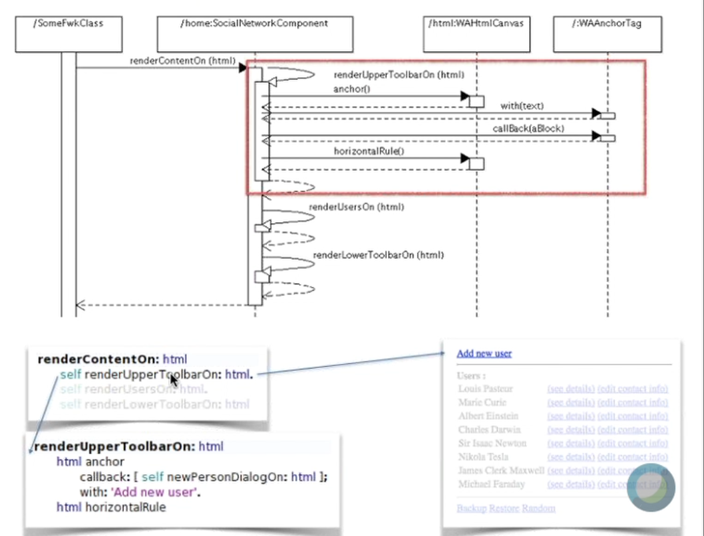
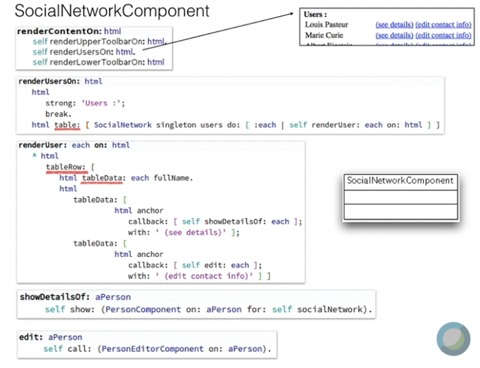
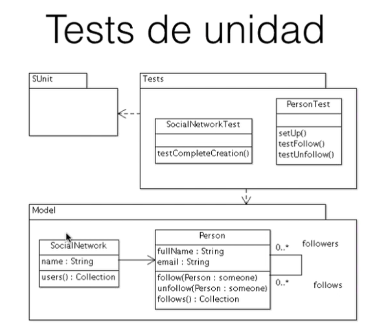

# TyH - Séptima clase remota - 14/06

## Plugins para browsers
* Tampermonkey: run your own JS scripts
* Greasyfork.org: public scripts
* Userstyles.org: CSS

## SeaSide 3.2

Con SeaSide no vamos a escribir JS, CSS ni HTML
* HTML programático
* Una aplicación es un conjunto de componentes
  * Componentes para modelar: navegación y reuso

### Instalación
* Pharo -> Tools -> Catalog Browser
* "Bootstrap for Seaside" Install stable version
#### Configurar un servidor
* Tools -> Seaside Control Panel -> Add adaptor...
* `ZnZincServerAdaptor`, any port

### Programar una aplicación
* Implementar `renderContentOn: htmlCanvas`
* `WAAdmin register: self asApplicationAt: 'HolaMundo'`
  * Define dónde se va a registrar el componente
  * `localhost:8080/HolaMundo`

* Cada página es un componente
* Las páginas pueden tener hijos y navegan entre sí
* Convención: `PersonComponent`, `PersonEditorComponent`
* Cada componente se envía múltiples mensajes a sí mismo
  * `renderUpperToolbarOn()`
  * `renderUsersOn()`
  * `renderFooterOn()`
    * 7+/-2 líneas de código por método

#### Trabajo Práctico y Unit Tests - TP & UT
* Tests en un paquete separado
* **DUDA:** ¿Hay que hacer el diagrama de clases de los UT?
* **DUDA:** ¿Hay incluir validaciones?
* No evalúan *CSS* ni nada de eso
* Sí se evalúa la separación entre el Modelo y la Vista, **es lo más importante**

